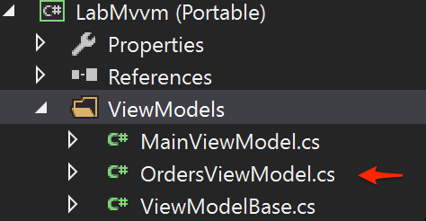
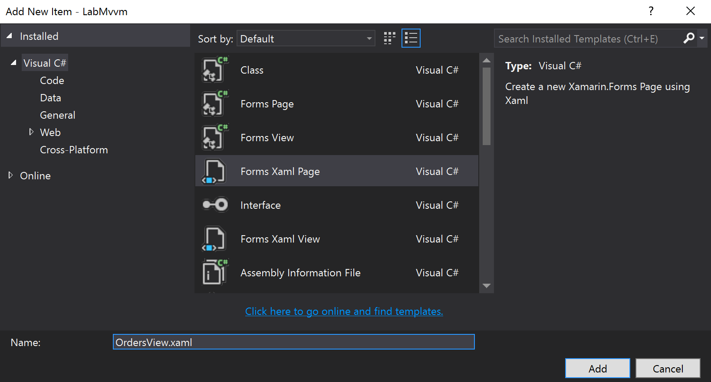
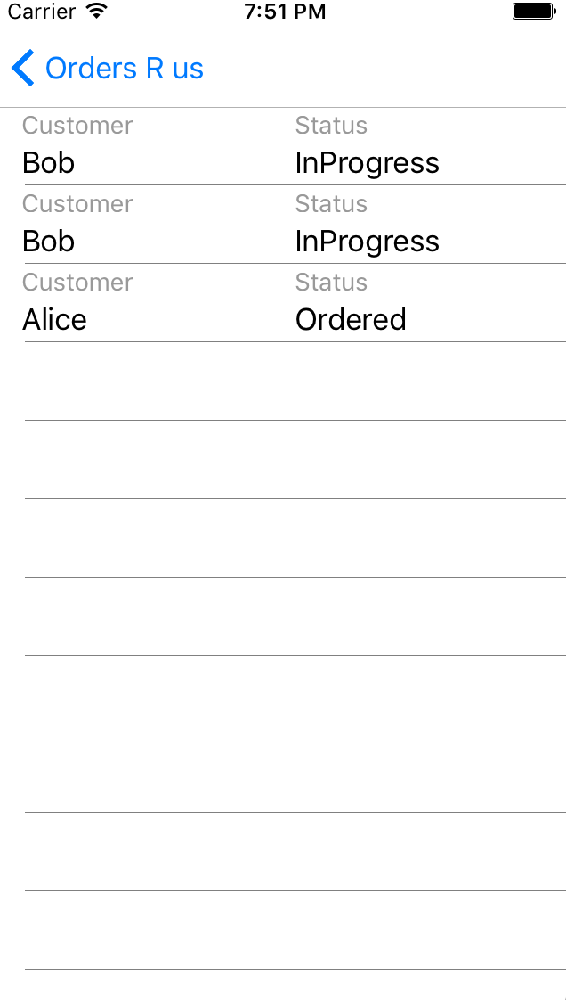
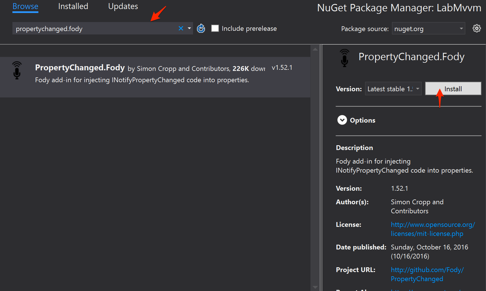
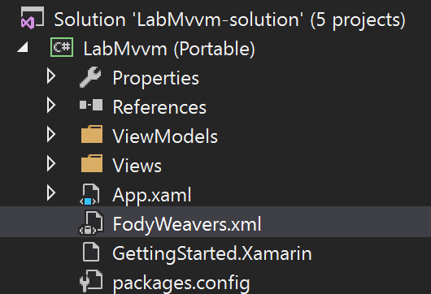
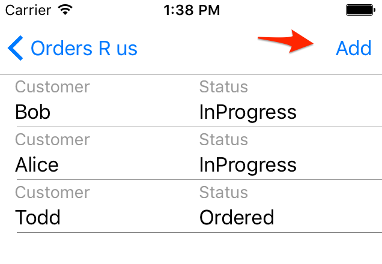

# Lab - MVVM och Data Bindings

**Tid:** 60 minuter

**Område:** cross-platform (Xamarin Forms)


**Miljö:**

* Mac med Xamarin Studio och XCode (om iOS, Android och/eller Mac OS X)
* Windows maskin med Visual Studio (om Windows, WP, Android)

## Syfte med labben
Att tillhandahålla grundläggande kunskaper för att komma igång med MVVM och Data Bindings.

Det finns en hel del ramverk kring MVVM. Denna labb visar grundläggande MVVM utan tredje-parts ramverk. 

## Förberedande arbete

### Klona miljön
```
git clone https://github.com/dhindrik/TDswe16.git
```

### Öppna solution filen
Öppna solution filen i **Visual Studio** eller i **Xamarin studio**.

```
/TDSwe16/Lab - MVVM and Data Bindings/Lab/LabMvvm.sln
```

Om man skulle köra fast eller bara vill fuska lite så finns det en katalog som heter ```solution``` där man kan titta på hur det skulle ha blivit.

## Instruktioner

### Öppna solution filen
1.	Starta Visual Studio (eller Xamarin Studio)
2. Öppna solution filen ``LabMvvm.sln``

	> **Varför** - Projektet innehåller ett antal projekt
	>
	>* Ett gemensamt PCL-projekt där vi kommer lägga vyer, vymodeller och gemensam kod
	>* Tre (eller fler) plattformsspecifika projekt som hanterar uppstart på respektive plattform samt plattformsspecifik kod.
	>* Ett core bibliotek som innehåller kod som inte är relaterat till GUI

3. Testa att bygga projektet, du behöver inte starta det i en emulator/device än.

### Sätt upp strukturen
Ett MVVM-projekt följer oftast vanligtvis en grundläggande struktur. Det första vi behöver är två kataloger för att separera vyer (UI) från vymodeller (data).

1. Öppna upp projektet *LabMvvm (portable)*
2. Skapa katalogerna **Views** och **ViewModels**

	

	>**Varför** - Normalt vill man dela upp vyer och vymodeller för att tydligt separera deras respektive funktion. Om det dessutom är ett projekt som sträcker sig utanför de plattformar som stöds av Xamarin Forms så kan man lägga vymodeller i ett eget bibliotek om man önskar.

### Skapa den första vyn - MainView.xaml

Alla appar behöver en startsida.

1. Högerklicka på *Views*-katalogen under *LabMvvm (portable)* och välj ``Add -> New Item``
2. Välj ``Forms Xaml Page``och skriv ``MainView.xaml`` och klicka på ``Add``
	
	

	>**VIKTIGT** - Se till att välja **Forms Xaml Page** och inte **Forms Page** som är två items upp. Väljer du den övre får du en vy som är helt definierad i C#. Det är fullt möjligt att göra samma sak utan Xaml men hela denna labb bygger på Xaml.
	
3. Öppna ``MainView.xaml`` genom att dubbelklicka på den
4. Ändra Text-attributen från

	```xaml
	Text="{Binding MainText}"
	```
	till
	
	```xaml
	Text="Jag är MainView"
	```

	>**Varför** - Vi kommer till databindning (Data Binding) längre fram i labben. Just nu vill vi bara se innehåll.
	
	>**Xaml-fakta** - Xaml är inte ett språk/markup för att definera GUI. Det är en markup för att instansiera objekt. *Förvirrad? Fråga deltagaren till vänster om denne förstår vad som menas med denna mening*.
	
5. Öppna Xamarin Previewer för att förhandsgranska resultatet

	>I **Visual Studio** hittar du Xamarin Previewer (som är i Preview dessutom) under ```View -> Other windows -> Xamarin.Forms Previewer```. Man måste bygga det plattformsspecifika projektet för att få se en preview. 
	
	>I **Xamarin Studio** öppnas Xamarin Previewer automatiskt när du öppnar en Xaml-fil.
	
	>**Alternativ** - Det finns en annan produkt som heter Gorilla Player som är värd att ta en titt på. Den har fördelen att man kan köra den på multipla fysiska enheter och nackdelen att den bara parsar Xaml-kod. Custom renderers mm kan man få att fungera men det är lite krångligare. Fråga gärna efter en demo av Gorilla Player.
	
	
	*Xamarin.Forms Previewer i Visual Studio*
	
### Sätt MainView som startsida

1. Radera filen ``MainPage.xaml``som ligger i roten på *LabMvvm*.

	

2. Leta upp filen ``App.xaml.cs``

	

	> Den ligger som en relaterad fil till App.xaml så du måste öppna upp App.xaml först.

3. Ändra innehållet i konstruktorn till 

	```csharp
	public App()
   {
		InitializeComponent();

      	MainPage = new LabMvvm.Views.MainView();
   }
   ```
   
   >**Varför** - MainPage är en egenskap på klassen `Xamarin.Forms.Application`. Den ska peka på en instans av en `Xamarin.Forms.Page`. App-klassen är den klass som hanterar uppstart av vårt forms-projekt. 
   
	
4. Välj vilken plattform du vill testa på genom att högerklicka på iOS-, Android- eller Windows-projektet och välj ``Set as StartUp Project``.

	

5. Välj passande inställningar beroende på plattform. Ex för iOS, välj att köra på Device eller Simulator.

	
	
6. Klicka på "play" eller tryck F5

	>Första uppstarten av simulator kan ta lite tid. Om du kör android så se till att ha en x86-baserad emulator.
	
	

### Skapa en vymodell
I denna sektion kommer vi börja känna kraften av MVVM. Vi ska skapa den första vy-modellen.

> En vymodell har i uppgift att tillhandahålla data till vyn och hantera events från densamma. En **vy** har endast i uppgift att visa saker på en skärm och **vymodellen** hanterar all logik. (Det finns små undantag så klart) :)

Vymodellen exponerar kommandon (actions) och egenskaper (data) till vyn. 

1. Skapa MainViewModel.cs genom att högerklicka på ViewModels katalogen och välj `Add` -> `Add new item`. 
2. Välj `class` och skriv in `MainViewModel.cs` som namn.

	

3. Gör klassen publik.

	```csharp
	public class MainViewModel
    {
    }
	```

	> Denna klass gör inte särskilt mycket av sig själv så vi måste utöka den med INotifyPropertyChanged och lite faktiska egenskaper att databinda mot.

### Implementera INotifyPropertyChanged

INotifyPropertyChanged är ett interface definierat i `System.ComponentModel` och är inte Xamarin-specifikt. Det ger fördelar om man vill dela vymodeller med plattformar som ej stöds av Xamarin. Definitionen av interfacet ser ut som nedan:

```csharp
    // ENDAST EXEMPEL
    public interface INotifyPropertyChanged
    {
        event PropertyChangedEventHandler PropertyChanged;
    }
```

>Detta är en av grundbultarna i MVVM och det är genom detta interface som vyn kommer att kommunicera tillbaka till vymodellen på ett löst kopplat sätt. Vyn förutsätter att vymodellen har INotifyPropertyChanged implementerat och lägger en lyssnare på detta event. På detta sätt kan en löst kopplad vymodell kommunicera med vyn att egenskaper har förändrats.

1. Lägg till `using System.ComponentModel` i bland de övriga using-uttrycken.

	```csharp
	using System.ComponentModel; // <--
	// other usings omitted

	namespace LabMvvm.ViewModels
	{
		public class MainViewModel 
		{
		}
	}
	```

2. Implementera `INotifyPropertyChanged` och lägg till en hjälp-metod för att enklare trigga eventet.

	```csharp
    public class MainViewModel : INotifyPropertyChanged
    {
        public event PropertyChangedEventHandler PropertyChanged;

        public void RaisePropertyChanged(string propertyName)
        {
            PropertyChanged?.Invoke(this, new PropertyChangedEventArgs(propertyName));
        }
    }
	```

	> **Varför** - Vi lägger till en hjälpmetod för att enklare kunna kasta event vid förändring av data.

3. Lägg till en egenskap som vi vill exponera till vyn. 

	```csharp
 	public class MainViewModel : INotifyPropertyChanged
    {
        public event PropertyChangedEventHandler PropertyChanged;

        public void RaisePropertyChanged(string propertyName)
        {
            PropertyChanged?.Invoke(this, new PropertyChangedEventArgs(propertyName));
        }

        private string _name;
        public string Name
        {
            get
            {
                return _name;
            }
            set
            {
                _name = value;
                RaisePropertyChanged(nameof(Name));
            }
        }
    }
	```

	Det som händer här är att vi kan hämta Name och sätta Name. När vi sätter Name så måste vi kasta eventet `RaisePropertyChanged` och det gör vi via den metod vi skapade tidigare.

	> **Varför** - 	Name är en klassisk C# egenskap. Normalt sett hade man använt den enklare syntaxten `public string Name { get; set; }` men eftersom vi måste anropa `RaisePropertyChanged` på settern så kan vi inte använda oss av den kortare varianten. Men oroa dig inte, det finns snygga vägar runt detta också. Vi kommer till det i extra-materialet.

### Instansiera vymodellen i vyn

1. Öppna filen `Views/MainView.xaml.cs`

	

2. Skapa en instans av MainViewModel och tilldela den till BindingContext

	```csharp
	using LabMvvm.ViewModels;
	using Xamarin.Forms;

	namespace LabMvvm.Views
	{
		public partial class MainView : ContentPage
		{
			public MainView()
			{
				InitializeComponent();

				var vm = new MainViewModel()
				{
					Name = "John Doe"
				};

				BindingContext = vm;
			}
		}
	}
	```

	> **Varför** - `BindingContext` är en egenskap som tillhör en ContentPage. Typen är `Object` och man är därför fri att tilldela vilket objekt man än önskar. Magin händer i vyn.
	>
	> Extramaterialet innehåller även delar för att införa Inversion of Control in i denna modell vilket är en viktig del i att få en hållbar arkitektur. 

### Databind till vymodellen

Vi har nu definerat en vymodell och knutit denna vymodell till vyn och måste utföra det sista steget för att få ett resultat.

1. Öppna `Views/MainView.Xaml`
2. Ändra värdet på Text-attributen till `{Binding Name}`.

	Från
	```xaml
	Text="Jag är MainView"
	```
	Till
	
	```xaml
	Text="{Binding Name}"
	```
	> **Varför** - Binding är en extension definerad i Xaml. 

3. Kör igång appen igen! Du bör få något som liknar bilden nedan.

	

### Kommandon

För att en vy ska kommunicera tillbaka till en vymodell och faktiskt utgöra arbete så använder man sig av `Commands`. Detta är egenskaper som exponerar en funktion som är inlindad i ett `ICommand`-interface.

1. Ändra vyn till följande Xaml.

	```xaml
	<?xml version="1.0" encoding="utf-8" ?>
	<ContentPage xmlns="http://xamarin.com/schemas/2014/forms"
             xmlns:x="http://schemas.microsoft.com/winfx/2009/xaml"
             x:Class="LabMvvm.Views.MainView">
  		<StackLayout Padding="40">
    		<Label Text="Ditt namn:" />
    		<Entry Text="{Binding Name}" />
			<Button Command="{Binding SayHi}" Text="Say hi!" />
    		<Label Text="{Binding Greeting}" />
  		</StackLayout>
	</ContentPage>
	```

	>**Varför** - Vi ändrade en hel del i Xaml-koden. Samtliga kontroller har vi gått genom tidigare i genomgången av Xamarin Forms. Här kommer en snabb sammanfattning iallafall.
	>
	> En `ContentPage` kan bara ha en child och det är innehållet direkt under den initiala deklarationen av `ContentPage`. Denna vy använder nu `StackLayout` som rot-element och i den lägger vi upp en `Label` för att skriva en rubrik, en `Entry` för att mata in information och en `Label` för att skriva ut information.
	>
	>Utöver det introducerar vi `Button` som motsvarar en knapp. Alla kontroller som utför någon slags åtgärd har en attribut som heter `Command` och som vi i vy-modellen sedan knyter mot en egenskap som är av typen `ICommand`.

2. Lägg till följande kod i MainViewModel.cs och lägg till de usings som saknas.

	```csharp
	public string Greeting
	{
		get { return $"Hi {Name}"; }
	}

	public ICommand SayHi
	{
		get {
			return new Command(
				() => RaisePropertyChanged("Greeting"));
		}
	}
	```

	>**Varför** - I exemplet ovan ser vi två nya varianter av egenskaper. Den första, `Greeting`, är bara `read-only` och returnerar en sträng baserat på en annan egenskap. Den andra är ett kommando som ska utföras om man väljer att trigga den kontrollen. Man kan även ha ett backing-field för kommandot men i praktiken är det av mindre betydelse då vyn kommer att binda mot kommandot och hålla den referensen i minne.

	3. Ändra MainView.cs till följande

	```csharp    
	public partial class MainView : ContentPage
    {
        public MainView()
        {
            InitializeComponent();
            BindingContext = new MainViewModel();
        }
    }
	```

	>**Varför** - Vi förbereder lite för det som komma skall och tar därför bort initiering av vymodellen i vyn.

	4. Testkör appen genom att starta, skriva in ett namn i textboxen och därefter klicka på knappen.

	5. Som en extra övning, testa att lägg till följande Xaml någonstans inom `<StackLayout>`-taggen och testkör.

	```xaml
	<Label Text="{Binding Name}" />
	```

	>**Varför** - Varje tecken du skriver i `Entry`-kontrollen anropar uppdateras egenskapen `Name` i vymodellen. Det i sin tur triggar `PropertyChanged` som talar om för den `Label` vi nyss lade till att data har ändrats.

### Skapa en basklass för vymodellen

När man skrivit en del vymodeller så inser man att man kan flytta en del återkommande kod till en basklass. De flesta MVVM-ramverk definerar också en basklass.

Vår basklass kommer att ta hand om `INotifyPropertyChanged`-implementationen och förbereda för navigation inom appen.

1. Skapa en ny klass i ViewModels-katalogen och döp den till `ViewModelBase`.
2. Flytta koden för implementation av `INotifyPropertyChanged` från `MainViewModel` till den nya basklassen.

	```csharp
	using System.ComponentModel;
	using Xamarin.Forms;

	namespace LabMvvm.ViewModels
	{
        public abstract class ViewModelBase : INotifyPropertyChanged
        {
            public INavigation Navigation { get; set; }

        	public event PropertyChangedEventHandler PropertyChanged;

            public void RaisePropertyChanged(string propertyName)
            {
                PropertyChanged?.Invoke(this, new PropertyChangedEventArgs(propertyName));
            }
        }
    }
	```

	>**VARFÖR** - Det finns olika teorier på hur man ska lösa navigation i en MVVM-arkitektur. Denna lab visar hur man navigerar från vymodellen och genom att sätta en instans till ett objekt som implementerar INavigation.

3. Uppdatera koden i `MainViewModel` till att använda denna basklass och plocka bort den kod som implementerar `INotifyPropertyChanged`. (Plocka bort all kod mellan klassens början och deklarationen av _name).

	```csharp
	public class MainViewModel : ViewModelBase
	{
	    private string _name;
	    // rest omitted
	}
	```

4. Uppdatera koden i `MainView.xaml.cs`

	```csharp
	public partial class MainView : ContentPage
    {
        public MainView()
        {
            InitializeComponent();
            var vm = new MainViewModel();
            vm.Navigation = Navigation;
            BindingContext = vm;
        }
    }
	```

	>**Varför** - Vi har valt att dela instansieringen, tilldelningen av Navigation och tilldelningen av BindingContext på tre olika rader. Detta för att förbereda för vad som komma skall.
	>
	>Observera att vi tilldelar sidans Navigation-referens till vymodellen. Detta kan man också göra från Xaml om man önskar men man tappar en del klarhet om hur koden fungerar då. I grund och botten är det en smaksak.

### Ordersidan

Vi ska skapa en ordersida och navigera till den.

1. Skapa en ny klass under `ViewModels` som du döper till `OrdersViewModels`

	

	```csharp
	public class OrdersViewModel : ViewModelBase
	{
	}
	```

2. Skapa en ny `Forms Xaml Page` under `Views` som du döper till `OrdersView`.

	

3. Uppdatera konstruktorn i vyns code-behind, `Views/OrdersView.Xaml.cs`

	```csharp
	public OrdersView()
	{
		InitializeComponent();
		var vm = new OrdersViewModel();
		vm.Navigation = Navigation;
		BindingContext = vm;
	}
	```

### Skapa navigation till Ordersidan

1. Uppdatera `MainViewModel.cs` med ett kommando för att navigera till vyn som visar Orders.

	```csharp
	public ICommand NavigateToOrders
    {
        get
	    {
            return new Command(
                async () =>
                {
                    await Navigation.PushAsync(new OrdersView());
                });
        }
    }
	```

	>**VARFÖR** - Här är första stället som vi nyttjar den Navigation-referens som vi tilldelade tidigare.

2. Uppdatera `MainView.xaml` med en knapp för att exekvera kommandot

	```xaml
	<StackLayout Padding="40">
    	<Button Command="{Binding NavigateToOrders}" Text="View Orders" />
    	<!-- additional controls omitted -->
   </StackLayout>
	```

3. Sätt `NavigationPage` som MainPage i `app.xaml.cs`

	```csharp
	public App()
	{
		InitializeComponent();

		MainPage = new NavigationPage(new LabMvvm.Views.MainView());
	}
	```

	>**Varför** - En app som stödjer Navigering måste utgå från en `NavigationPage`. För iOS översätts detta till en `UINavigationController`. Man kan ha multipla `NavigationPage` exempelvis i en `TabbedPage`.
	>
	>**Extra** - När man har en NavigationPage kan man välja att sätta `Title`-attributen på en sida.
	```<ContentPage xmlns="http://xamarin.com/schemas/2014/forms"
             xmlns:x="http://schemas.microsoft.com/winfx/2009/xaml"
             x:Class="LabMvvm.Views.MainView"
             Title="Orders R us"> ```

### Databinding - listor
Vi ska nu skapa en vy med ordrar. Som datakälla använder vi ett redan färdigt repository i ett projekt kallat `MvvmLab.Core`

1. Ändra `OrdersViewModel.cs`

 	```csharp
 	public class OrdersViewModel : ViewModelBase
    {
        private OrderRepository _orderRepository;

        public OrdersViewModel()
        {
            _orderRepository = new Core.Repositories.OrderRepository();
        }

        public async Task LoadData()
        {
            Orders = new ObservableCollection<Order>(
                await _orderRepository.GetOrdersAsync()
            );
        }

        private ObservableCollection<Order> _orders;
        public ObservableCollection<Order> Orders
        {
            get
            {
                return _orders;
            }
            set
            {
                _orders = value;
                RaisePropertyChanged(nameof(Orders));
            }
        }
   }
   ```
	
	>**VARFÖR** - OrderRepository kommer från ett Core-projekt och representerar en datakälla. Man kan också tänka sig att vi refererar olika servicear eller liknande istället. Vi skapar en referens till den i konstruktorn. I en senare del av labben kommer vi instansiera dem på ett snyggare sätt.
	>
	>Metoden `LoadData()` hämtar data asynkront från datakällan och spar det returnerade datat i en lokal `ObservableCollection<T>`. Listor som man vet kommer att uppdateras genom att man lägger till eller tar bort objekt bör vara definerade som `ObservableCollection` då `ListView`-kontrollen hanterar events som defineras av ObservableCollection.
	>
	>Slutligen har vi den egenskap (`Orders`) som vi exponerar utåt mot vyn som håller listan med våra ordrar.

2. Uppdatera OrdersView med en ListView och databind den

	```xaml
	<?xml version="1.0" encoding="utf-8" ?>
	<ContentPage xmlns="http://xamarin.com/schemas/2014/forms"
				xmlns:x="http://schemas.microsoft.com/winfx/2009/xaml"
				x:Class="LabMvvm.Views.OrdersView">

	<ListView x:Name="OrderListView" ItemsSource="{Binding Orders}">
		<ListView.ItemTemplate>
		<DataTemplate>
			<ViewCell>
				<ViewCell.View>
					<Grid Padding="14,5,5,5">

					<Grid.RowDefinitions>
						<RowDefinition Height="10" />
						<RowDefinition Height="20" />
					</Grid.RowDefinitions>

					<Grid.ColumnDefinitions>
						<ColumnDefinition Width="*" />
						<ColumnDefinition Width="*" />
					</Grid.ColumnDefinitions>

					<!-- First Column -->
					<Label Text="Customer" FontSize="Small" TextColor="#999999" />
					<Label Text="{Binding Customer}" Grid.Row="1" />
					
					<!-- Second Column -->
					<Label Text="Status" FontSize="Small" TextColor="#999999" Grid.Column="1" />
					<Label Text="{Binding Status}" Grid.Row="1" Grid.Column="1" />
					</Grid>
				</ViewCell.View>
			</ViewCell>
		</DataTemplate>
		</ListView.ItemTemplate>
	</ListView>
	</ContentPage>

	```

3. Uppdatera OrdersView.xaml.cs med kod för att hämta data

	```csharp
    public OrdersView()
	{
		InitializeComponent();
		var vm = new OrdersViewModel();
		vm.Navigation = Navigation;
		BindingContext = vm;

		Device.BeginInvokeOnMainThread(async () => await vm.LoadData());
	}
	```

	>**VARFÖR** - `Device.BeginInvokeOnMainThread` låter dig definiera en funktion som du vill schemaläggas att köras på UI-tråden. Det kan vara lockade att lägga denna kod i vy-modellen och det fungerar om vy-modellen ligger i Form-projektet och inte i en eget externt bibliotek. Det finns även vägar runt detta men för denna lab så duger upplägget ovan.

4. Testkör appen och klicka på `View orders` på startvyn.

	

5. Om man väljer en rad i listan nu så blir den markerad. Detta är oftast inte önskvärt. Öppna `OrdersView.Xaml.cs` och lägg till kodraden nedan längst ner i konstruktorn.

	```csharp
	OrderListView.ItemSelected += (s, e) => OrderListView.SelectedItem = null;
	```

	>**VARFÖR** - Det normala beteendet i `ListView`-kontrollen är att valt element blir markerat tills du väljer ett annat. Eftersom vi vill navigera bort från denna vy när man väljer en order så vill vi inte returnera till den med en rad förvalt.

### Fody
Innan vi slösar bort mer tid av vårt liv att skriva onödig kod så ska vi introducera en räddare i nöden vid namn **Fody**. Fody är en *IL Weaver* som innebär att den redigerar den IL-kod som genereras av kompilatorn. Det finns massor av plugins till Fody och vi ska använda en plugin som heter `PropertyChanged.Fody`.

Den gör en sak och den gör det väldigt bra. Den implementerar INotifyPropertyChanged åt oss och tar hand om allt rörmokeri när det gäller att anropa RaisePropertyChanged.

Följande kod:

```csharp
private string _name;
public string Name
{
	get
	{
		return _name;
	}
	set
	{
		_name = value;
		RaisePropertyChanged(nameof(Name));
	}
}
```

Kan med hjälp av `PropertyChanged.Fody` ersättas med:

```csharp
public string Name { get; set; }
```

Installation och konfiguration är en relativt enkel process.

1. Installera nuget-paketet `Fody.PropertyChanged` i **LabMvvm (portable)** projektet.

	

2. Konfigurera PropertyChanged.Fody - **ENDAST XAMARIN STUDIO**:

	I roten på **LabMvvm (Portable)** skapas en fil som heter `FodyWeavers.xml`

	

	Öppna den och se till att den ser ut som exemplet nedan.

	```xml
	<?xml version="1.0" encoding="utf-8"?>
	<Weavers>
	  <PropertyChanged />
	</Weavers>
	```

	>**VARFÖR** - I nuget-paketet ingår ett PowerShell-skript som inte exekveras i Xamarin Studio. Därför läggs aldrig noden `<PropertyChanged />` med och man får då göra det manuellt.

3. Öppna `ViewModelBase` och ändra innehållet till följande:

	```csharp
	[ImplementPropertyChanged]
    public abstract class ViewModelBase 
    {
        public INavigation Navigation { get; set; }
    }
	```

	>**VARFÖR** - Vi har plockat bort allt som har med `INotifyPropertyChanged` att göra. Fody fixar det åt oss numera.

4. Öppna `OrdersViewModel.cs` och egenskapen Orders till följande

	```csharp
	public ObservableCollection<Order> Orders { get; set; }
	```

5. Öpnna `MainViewModel.cs` och ändra innehållet till följande:

	```csharp
	public class MainViewModel : ViewModelBase
    {
        public string Name { get; set; }

        public string Greeting { get; set;  }

        public ICommand SayHi
        {
            get
            {
                return new Command(
                    () => Greeting = $"Hi {Name}");
            }
        }

        public ICommand NavigateToOrders
        {
            get
            {
                return new Command(
                    async () =>
                    {
                        await Navigation.PushAsync(new OrdersView());
                    });
            }
        }
    }
	```

6. Testkör projektet och allt fungerar förhoppningsvis som innan.

	>**VARFÖR** - Fody hjälper oss att fokusera på att skriva mindre mängd kod. Läs gärna mer på [https://github.com/Fody/PropertyChanged](https://github.com/Fody/PropertyChanged)

### Add/Edit order vy

1. Skapa `ViewModels/AddOrderViewModel.cs` och lägg till följande innehåll:

	```csharp
	public class AddOrderViewModel : ViewModelBase
    {
        private OrderRepository _orderRepository;

        public string Customer { get; set; }
        public string OrderText { get; set;  }

        public AddOrderViewModel()
        {
            _orderRepository = new Core.Repositories.OrderRepository();
        }

        public ICommand CreateOrder
        {
            get
            {
                return new Command(async () =>
                {
                    await _orderRepository.Create(Customer, OrderText);
                    await Navigation.PopAsync();
                });
            }
        }
    }
	```

2. Skapa `Views/AddOrderView.xaml` och lägg tillföljande xaml

	```xml
	<?xml version="1.0" encoding="utf-8" ?>
	<ContentPage xmlns="http://xamarin.com/schemas/2014/forms"
              xmlns:x="http://schemas.microsoft.com/winfx/2009/xaml"
              x:Class="LabMvvm.Views.AddOrderView">
  
  	<ContentPage.ToolbarItems>
    	<ToolbarItem Name="Create" Command="{Binding CreateOrder}" />
  	</ContentPage.ToolbarItems>

  		<StackLayout Padding="10">
    
    		<Label Text="Customer" FontSize="Small" TextColor="#999999" />
    		<Entry Text="{Binding Customer}" Placeholder="Enter customer name" />

    		<Label Text="Order text" FontSize="Small" TextColor="#999999" />
    		<Editor Text="{Binding OrderText}" BackgroundColor="#EEEEEE" HeightRequest="200" />

  		</StackLayout>
	</ContentPage>
	
	```

3. Öppna `Views/AddOrderView.xaml.cs` och lägg till följande kod.

	```csharp
	public partial class AddOrderView : ContentPage
    {
        public AddOrderView()
        {
            InitializeComponent();
            var vm = new AddOrderViewModel();
            vm.Navigation = Navigation;
            BindingContext = vm;
        }
    }
	```

3. Öppna `Views/Orders.xaml` och lägg till `IsPullToRefreshEnabled` och `RefreshCommand` på ListView-taggen 

	```xaml
	<ListView x:Name="OrderListView" 
			  ItemsSource="{Binding Orders}" 
			  IsPullToRefreshEnabled="True" RefreshCommand="{Binding Refresh}"
			  SelectedItem="{Binding SelectedOrder}">
	```

4. Öppna `ViewModels/OrdersViewModel.cs` och lägg till ett kommando för att hantera Refresh.

	```csharp
	public ICommand Refresh
    {
	   get
       {
          return new Command(async () =>
	      {
	         IsRefreshing = true;
             await LoadData();
	         IsRefreshing = false;
	      });
       }
    }

    public bool IsRefreshing { get; set; }
	```

	>**VARFÖR** - Vi laddar om data genom att anropa `LoadData()` igen. För att vyn ska hålla koll på om den ska visa ladda-snurran eller ej så lägger vi till ett kontrollfält för det som vi kallas för `IsRefreshing`. Denna är bunden till Listvyns motsvarighet.

5. Justera även `LoadData()` i samma klass

	```csharp
    public async Task LoadData()
    {
        if(Orders == null)
        {
            Orders = new ObservableCollection<Order>();
        }
        else
        {
            foreach (var order in await _orderRepository.GetOrdersAsync())
            {
                if(!Orders.Any(e=>e.Id == order.Id))
                {
                   Orders.Add(order);
                }
            }
        }
	}
	```

	>**VARFÖR** - Vi vill bara uppdatera listvyn med nya ordrar. Detta är kärnan i att använda ObservableCollection.

### Lägg till en ToolbarItem för att skapa en ny order 

För att komma åt vyn som lägger till orders måste vi navigera till den. Vi gör det via en Toolbar-knapp. Det skulle givetvis gå bra med vilken knapp som helst.



1. Öppna `Views/Orders.xaml` och lägg till följande Xaml direkt under rot-noden `ContentPage`.

	```xaml
 	<ContentPage.ToolbarItems>
    	<ToolbarItem Name="Add" Command="{Binding AddOrder}" />
  	</ContentPage.ToolbarItems>
	```

2. Lägg till det Command vi refererar till i `ViewModels/OrdersViewModel.cs`

	```csharp
	public ICommand AddOrder
	{
	   get
	   {
	      return new Command(async () =>
	      {
	         var view = new AddOrderView();
	         await Navigation.PushAsync(view);
          });
	   }
	}
	```

3. Testkör! Det bör nu i teorin gå att lägga till en order och sedan göra en pull to refresh för att ladda om ordersidan.

	>**VIKTIGT** - Vi har medvetet valt att göra en Pull-To-Refresh för att ladda om. Det finns flera olika varianter att uppdatera listan. Fråga din handledare om du är intresserad av vilka andra sätt som du kan göra det på.

### Skapa navigation från orderlistan

1. Öppna `ViewModels/OrdersViewModel.cs`
2. Lägg till följande kod någonstans i klassen

	```csharp
	public Order SelectedOrder
    {
        set
        {
            if(value!=null)
            {
                Device.BeginInvokeOnMainThread(async () =>
                {
                    var view = new EditOrderView();
                    var vm = view.BindingContext as EditOrderViewModel;
                    await Navigation.PushAsync(view);
                    await vm.LoadData(value.Id);
                });
            }
        }
    }
	```

3. Öppna `Views/Orders.xaml`.
4. Lägg till `SelectedItem="{Binding SelectedOrder}` som attribut på ListView-taggen.

	```xaml
	<ListView x:Name="OrderListView" 
			  ItemsSource="{Binding Orders}" 
			  IsPullToRefreshEnabled="True" RefreshCommand="{Binding Refresh}"
			  SelectedItem="{Binding SelectedOrder}">
	```

	>**VARFÖR** - Vald "item" i en lista är bindningsbart. Vi nyttjar det faktumet och utför navigationslogiken i settern i vymodellen.

## Extramaterial (kommer senare)

Allt i denna sektion är tips och trix för att förbättra den lilla applikation vi har skapat.

### Extra material - Autofac för IoC

* Implementera IoC för snyggare fin-kod

### Extra material - TinyPubSub

* Uppdatera orderlistan direkt vid lägg till order

### Extra material - ACR Dialogs

* 

### Extra utmaningar

* Lägg till en knapp för att ta bort en order
