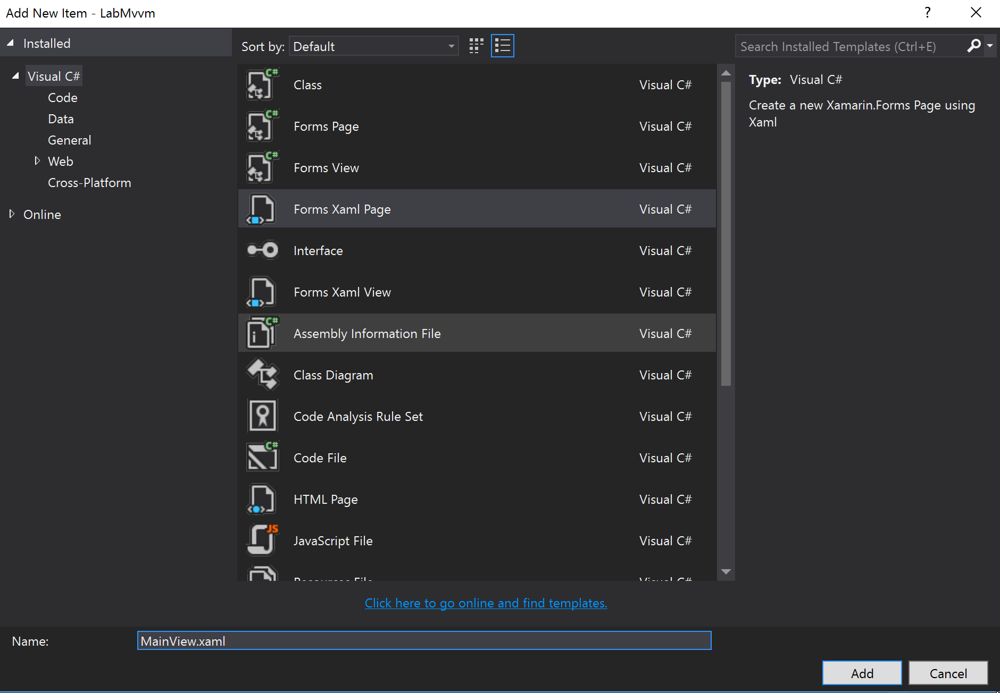

#Lab - MVVM och Data Bindings

**Tid:** 60 minuter

**Område:** cross-platform (Xamarin Forms)


**Miljö:**

* Mac med Xamarin Studio och XCode (om iOS, Android och/eller Mac OS X)
* Windows maskin med Visual Studio (om Windows, WP, Android)

##Syfte med labben
Att tillhandahålla grundläggande kunskaper för att komma igång med MVVM och Data Bindings.

##Förberedande arbete

### Klona miljön
```
git clone https://github.com/dhindrik/TDswe16.git
```

### Öppna solution filen
Öppna solution filen i **Visual Studio** eller i **Xamarin studio**.

```
/TDSwe16/Lab - MVVM and Data Bindings/Lab/LabMvvm.sln
```

Om man skulle köra fast eller bara vill fuska lite så finns det en katalog som heter ```solution``` där man kan titta på hur det skulle ha blivit.

## Instruktioner

### Öppna solution filen
1.	Starta Visual Studio (eller Xamarin Studio)
2. Öppna solution filen ``LabMvvm.sln``

> **Varför** - Projektet innehåller fyra projekt
>
* Ett gemensamt PCL-projekt där vi kommer lägga vyer, vymodeller och gemensam kod
* Tre (eller fler) plattformsspecifika projekt som hanterar uppstart på respektive plattform samt plattformsspecifik kod.

### Sätt upp strukturen (del 1)
Ett MVVM-projekt följer oftast vanligtvis en grundläggande struktur. Det första vi behöver är två kataloger för att separera vyer (UI) från vymodeller (data).

1. Öppna upp projektet *LabMvvm (portable)*
2. Skapa katalogerna **Views** och **ViewModels**

	

### Skapa den första vyn - MainView.xaml

Alla appar behöver en startsida.

1. Högerklicka på *Views*-katalogen under *LabMvvm (portable)* och välj ``Add -> New Item``
2. Välj ``Forms Xaml Page``och skriv ``MainPage.xaml`` och klicka på ``Add``
	
	
	
3. Öppna ``MainPage.xaml`` genom att dubbelklicka på den
4. Ändra Text-attributen från

	```xaml
	Text="{Binding MainText}"
	```
	till
	
	```xaml
	Text="Jag är MainView"
	```

	>**Varför** - Vi kommer till databindning (Data Binding) längre fram i labben. Just nu vill vi bara se innehåll.
	
	>**Xaml-fakta** - Xaml är inte ett språk/markup för att definera GUI. Det är en markup för att instansiera objekt. *Förvirrad? Fråga deltagaren till vänster om denne förstår vad som menas med denna mening*.
	
5. Öppna Xamarin Previewer för att förhandsgranska resultatet

	>I Vi
	
### Sätt MainView som startsida

1. Leta upp filen ``App.xaml.cs``

	

2. Ändra innehållet i konstruktorn till 

	```csharp
	public App()
   {
		InitializeComponent();

      	MainPage = new LabMvvm.Views.MainView();
   }
   ```
   
3. Radera filen ``MainPage.xaml``som ligger i roten på *LabMvvm*. OBS, förväxla inte denna fil med ``MainView.xaml`` som du skapade tidigare.

	>**Varför** - App-klassen är den klass som hanterar uppstart av vårt forms-projekt. Denna klass har egenskapen ``MainPage`` som ska peka mot en referens av ett objekt som ärver av ``ContentPage``, vilket vår ``MainView.xaml`` gör.
	
4. Välj vilken plattform du vill testa på genom att högerklicka på iOS-, Android- eller Windows-projektet och välj ``Set as StartUp Project``.

	

5. Välj passande inställningar beroende på plattform. Ex för iOS, välj att köra på Device eller Simulator.

	
	
6. Klicka på "play" eller tryck F5

	>Första uppstarten av simulator kan ta lite tid. Om du kör android så se till att ha en x86-baserad emulator. Det enklaste trixet är att ladda hem Xamarin Android Player.
	
	

### Skapa en vymodell och databind
TODO

* Skapa MainViewModel
* Implementera INotifyPropertyChanged
* Skapa vymodellen i vyn
* Databind till vymodellen

### Navigation till ordersidan
TODO

* Skapa OrdersView 
* Skapa OrdersViewModel
* Skapa en basklass för vymodeller (flytta navigation hit)
* Uppdatera alla vymodeller att ärva från den basklassen
* Uppdatera MainViewModel med ett ICommand för att navigera till OrdersView
* Uppdatera MainView med en knapp som databinder till ICommand

### Databinding - listor
TODO

* Uppdatera OrdersView med en ListView
* Uppdatera OrdersViewModel med att använda OrderRepository
* Exponera en egenskap med orders i en ObservableCollection<T>
* Implementera delete med swipe gesture

### Add order vy

TODO

* Skapa en AddOrderView + modell
* Koppla till repository
* Uppdatera OrdersView med en Pull to refresh

### Extra material - TinyPubSub

* Uppdatera OrdersView direkt vid Add order

### Extra material - Fody

* Slipp INotifyPropertyChanged

### Extra material - Autofac för IoC

* Implementera IoC för snyggare fin-kod

###


### Interna noteringar

* Skapa en IOrderRepository med implementation
* 
	
	
	
	