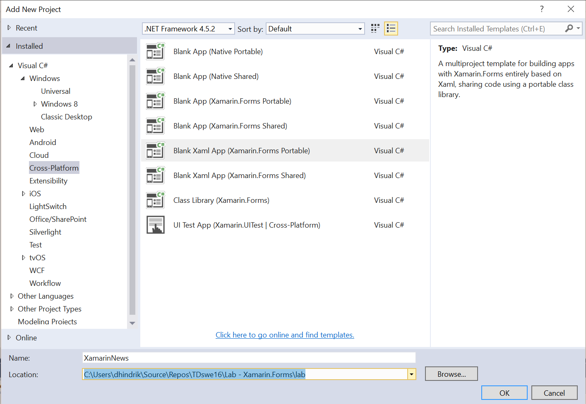
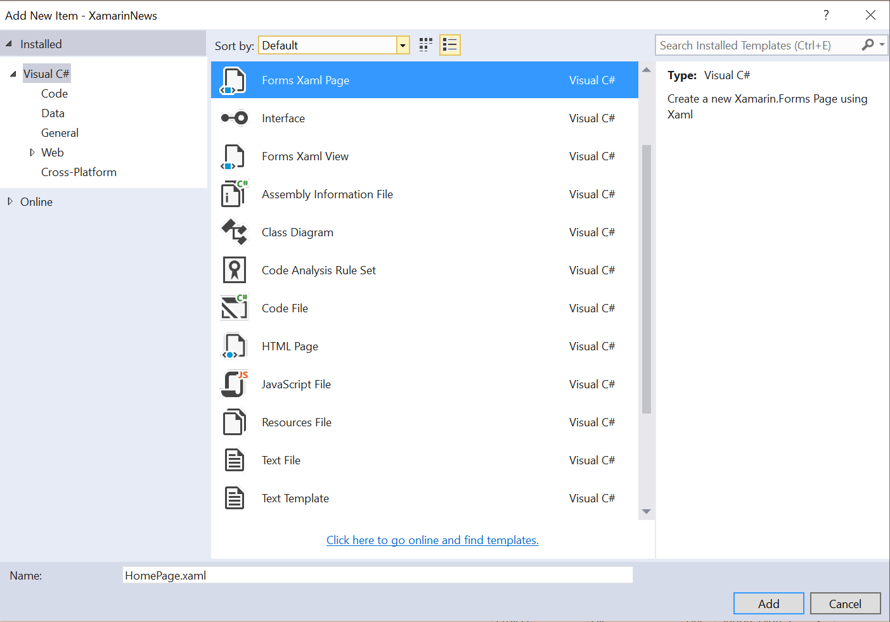

#Lab - Xamarin.Forms

**Tid:** 60 minuter

**Område:** iOS


##Syfte med labben
Att tillhandahålla grundläggande kunskaper för att komma igång att utveckla appar för iOS, Android och Windows med Xamarin.Forms

##Förberedande arbete

### Klona miljön
```
git clone https://github.com/dhindrik/TDswe16.git
```

### Öppna solution filen
Öppna solution filen i **Visual Studio** eller i **Xamarin studio**.

```
/TDSwe16/Lab - Xamarin.Forms/lab/XamarinNews.sln
```

Om man skulle köra fast eller bara vill fuska lite så finns det en katalog som heter ```solution``` där man kan titta på hur det skulle ha blivit.

## Instruktioner

1. Skapa nytt projekt från mallen "Blank Xaml App (Xamarin.Forms.Portable)". Mallen finns under Cross-Platform under Visual C# i "Add New Project" fönstret. Ge projektet namnet "XamarinNews".

	
	
2. Skapa två nya "Forms Xaml Page" i projektet Xamarin.News och döp dem "HomePage" och "NewsPage".
	
	
	
3. I MainPage byt ut ContentPage som basklass till TabbedPage. Detta måste göras i både xaml- och xaml.cs-filen.

4. I MainPage.xaml.cs lägg till de två raderna nedan under ```InitializeComponent()``` för att lägga till två tabbar. NavigationPage används för att kunna navigera inuti tabbarna

	```csharp
	 	Children.Add(new NavigationPage(new HomePage()));
    	Children.Add(new NavigationPage(new NewsPage()));
	```

5. Ikoner är plattformsspecifika, därför måste alla ikoner läggas till på varje plattform. i iOS ska ikoner ligga i Resourcesmappen. Ikoner för olika upplösningar hanteras med hjälp av filnamnet. Ikoner för retina skämrar ska till exemperl vara namngivna enligt följande "filnamn@2x.png". För text iPhone 6 plus ska @3x användas. 

	För Android ska ikoner ligga i Resources/Drawable. Ikoner för olika upplösningar läggs i olika mappar, tex Drawable-hdpi.
	
	Finns inte ikonen i rätt upplösning, kommer iOS respektive Android att skala ikoner automatiskt.
	
	För labben finns i icons mappen som ligger i rootmappen för labben. 
	
	Lägg till "home.png" och "news.png" till Resources i iOS-projektet och döp om dem till "home@2x.png" och "news@2x.png". För Android lägg dem i mappen xhdpi. För Windows behöver vi inte lägga till dessa ikoner då det inte används ikoner för TabbedPage där.

6. Normalt lägger man till ikoner till tabbarna genom att använda Icon-egenskapen på respektive sida. Lägg även till en titel på varje sida som koden visar nedan.
	
	```xml
<ContentPage xmlns="http://xamarin.com/schemas/2014/forms"
             xmlns:x="http://schemas.microsoft.com/winfx/2009/xaml"
             x:Class="XamarinNews.HomePage"
				Title="Home"
				Icon="home.png">
	```
	```xml
	<ContentPage xmlns="http://xamarin.com/schemas/2014/forms"
             xmlns:x="http://schemas.microsoft.com/winfx/2009/xaml"
             x:Class="XamarinNews.NewsPage"
				Title="News"
				Tite="news.png">
	```
	Men eftersom vi har en NavigationPage för varje tabb behöver Title och Icon sättas på NavigationPage.
	
	```csharp
	Children.Add(new NavigationPage(new HomePage()) { Title = "Home", Icon = "home.png" });
    Children.Add(new NavigationPage(new NewsPage()) { Title = "News", Icon = "news.png" });
    ```
	
7. För att få se live vad som händer när XAML ändras, öppna Xamarin.Forms Previewer. Den finns under View -> Other Windows -> Xamarin.Forms Previewer.
8. Lägg till en StackLayout i HomePage. En StackLayout lägger komponenter efter varandra, standard är att den lägger dem vertikalt. Lägg även till Padding och Spacing. Padding är komponenternas avstånd till kanterna och  Spacing är avståndet mellan komponenterna i StackLayouten.
	
	```xml
	<StackLayout Padding="10" Spacing="10">
		
	</StackLayout>
	```
9. Alla komponenter kan tilldelas ett namn för att användas från "code behind". Detta namn sätts genom att använda ```x:Name```. 
	
	Skapa två inputfält, ett för e-post och ett för lösenord (Entry i Xamarin.Forms) och två knappar, en för att logga in och en för att registrera sig. För att göra ett inputfält till ett lösenordsfält används IsPassword-egenskapen på Entry. Alla komponenterna ska inuti StackLayouten som vi skapade i förra steget.
	
	```xml
	<StackLayout Padding="10" Spacing="10">
		<Entry x:Name="Email" Placeholder="Enter your email" />
		<Entry x:Name="Password" IsPassword="True" Placeholder="Enter your password" />
		<Button Text="Login" x:Name="Login" />
		<Button Text="Register" x:Name="Register" />
	</StackLayout>
	```
10. För att ändra färg på knapparna kan vi använda BackgroundColor- och TextColor-egenskaperna. För att slippa göra det på varje knapp i hela appenn går vi till App.xaml och skapar en Style. TargetType talar om fört vilken komponent som stylen ska användas för. För varje egenskap vi vill sätta i Stylen skapar vi en sätter. I detta fallet ändrar vi backgrunden till blå och textenfärgen till vit.

	```xml
<Application.Resources>
		<ResourceDictionary>
			<Style TargetType="Button">
				<Setter Property="BackgroundColor" Value="Blue" />
				<Setter Property="TextColor" Value="White" />
			</Style>
		</ResourceDictionary>
	</Application.Resources>
```

11. Om vi vill ha en egen färg på vissa knappar till exempel att Loginknappen ska vara grön kan vi sätta en nyckel på Stylen.

	```xml
<Style TargetType="Button" x:Key="LoginButton">
		<Setter Property="BackgroundColor" Value="Green" />
		<Setter Property="TextColor" Value="White" />
</Style>
```

	På Loginknapen sätter vi sedan att vi vill använda resuresen LoginButton.
	
	```xml
	<Button Text="Login" x:Name="Login" Style="{StaticResource LoginButton}" />
	```
12. I HomePage.xaml.cs skapa en eventhanterare och koppla den loginknappens Click event. I eventhanteraren kollar vi om något värde är angett i textfälten. Om båda fälten har värden navigerar vi vidare till WelcomePage. Navigeringen sker genom egenskapen Navigation som vi ärver från VisualElement som är en basklass till ContentPage. Om  fälten inte har värden vill vi visa en dialog som talar om det. Basklassen Page har en DisplayAlert metod vi kan använda för detta.

	```csharp
	public HomePage()
    {
        InitializeComponent();

		 //Add the event handler to the Clicked event
        Login.Clicked += Login_Clicked;
	}

        private void Login_Clicked(object sender, EventArgs e)
        {
            if(!string.IsNullOrWhiteSpace(Email.Text) && !string.IsNullOrWhiteSpace(Password.Text))
            {
                Navigation.PushAsync(new WelcomePage());
            }
            else
            {
                DisplayAlert("Could not login", "You have enter a invalid email address or an invalid password!", "OK");
            }
        }
	```
13. Gå till NewsPage.xaml för att skapa en lista med nyheter. För det skapar vi en ListView som vi ger namnet News. För listan vill vi skapa en mall för hur varje rad ska se ut. Det gör vi med hjälp av egenskapen ItemTemplate som ska vara av typen DataTemplate. Inuti DataTemplate kan vi specificera hur varje rad ska se ut. Varje rad i en lista måste bestå av en ViewCell. I ViewCell kan alla UI.komponenter läggas. Här lägger vi till en StackLayout med två labels för att visa en rubrik och ett datum när nyheten publicerades.Vi sätter HasUnevenRows till true på listan för att radernas höjd ska anpassas efter innehållet.


	```xml
		<ListView x:Name="News" HasUnevenRows="True">
		<ListView.ItemTemplate>
			<DataTemplate>
				<ViewCell>
					<StackLayout Padding="10">
							<Label />
							<Label />
					</StackLayout>
				</ViewCell>
			</DataTemplate>
		</ListView.ItemTemplate>
	</ListView>
	```

14.  Lägg till en referens i projektet XamarinNews till projektet Xamarin.News.Core, där finns färdig kod som hämtar data från Xamarins blog.