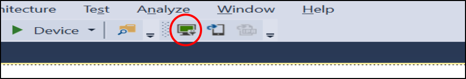
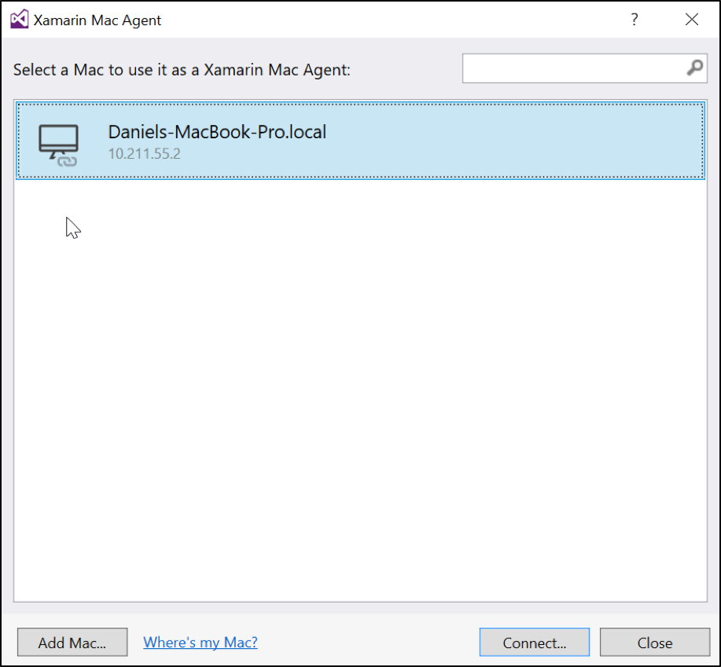
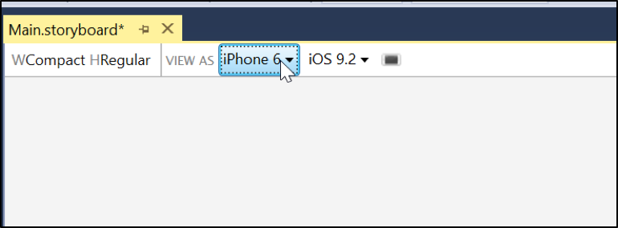
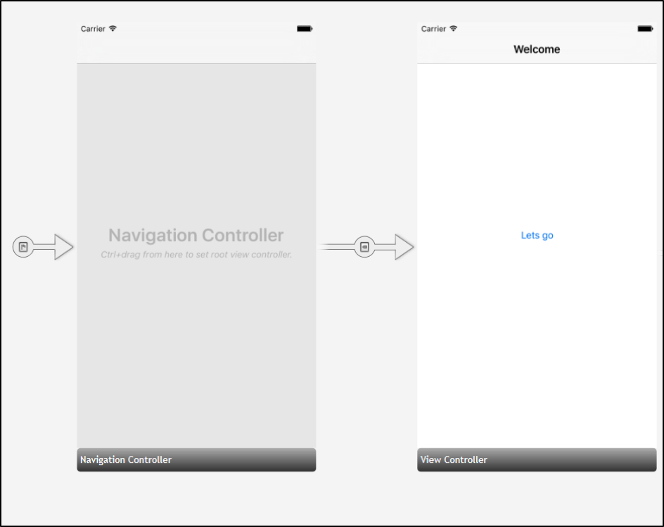
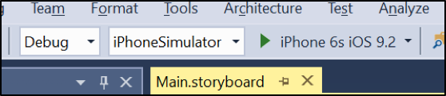
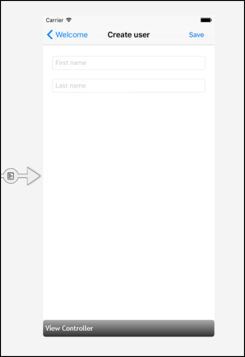
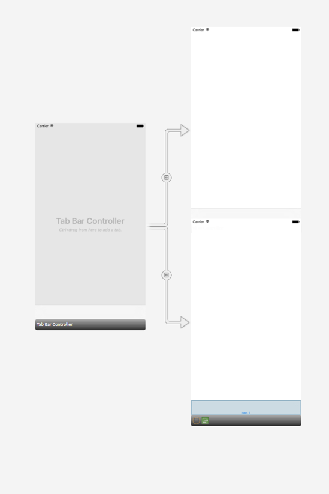
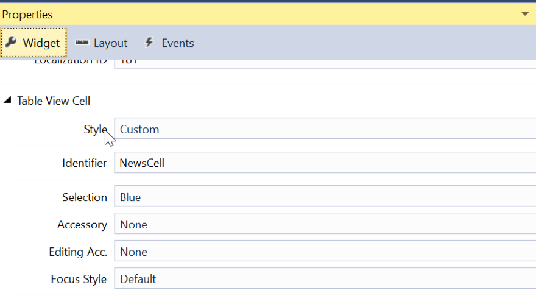

#Lab - Xamarin.iOS

**Tid:** 60 minuter

**Område:** iOS


**Miljö:**

* Mac med Xamarin Studio och XCode

##Syfte med labben
Att tillhandahålla grundläggande kunskaper för att komma igång att utveckla iOS-appar med Xamarin

##Förberedande arbete

### Klona miljön
```
git clone https://github.com/dhindrik/TDswe16.git
```

### Öppna solution filen
Öppna solution filen i **Visual Studio** eller i **Xamarin studio**.

```
/TDSwe16/Lab - Xamarin.iOS/lab/Xamarin.iOS.sln
```

Om man skulle köra fast eller bara vill fuska lite så finns det en katalog som heter ```solution``` där man kan titta på hur det skulle ha blivit.

## Instruktioner
1.	Starta Visual Studio (eller Xamarin Studio)
2.	Skapa nytt projekt
3.	Välj iPhone i kategoriträdet
4.	Välj en ”Single View App”
5.	Koppla upp mot Xamarin Mac Agent	

	
	

6.	Öppna Main.Storyboard.
7.	Ändra ”VIEW AS” till iPhone 6 från Generic.
	

8.	Ta bort allt befintligt i storyboarden.
9. För den här labben vill vi stänga av autolayout eftersom vi skulle kunna ha en hel pre-conf bara kring det. Det gör vi genom att klicka någonstans i storyboarden och sedan gå till properties fönstret och klicka ur rutan "Use Auto Layout".
9.	Öppna toolbox.
10.	Leta på NavigationController och dra den till storyboarden. En NavigationController skapar en navigeringsstack och lägger till en navigeringsbar i toppen på sidan. Där kommer det automatiskt visas en bakåtknapp när man har navigerat till en ny sida.
11.  Ta bort vyn med texten "Root ViewController" och dra ut en ny "View Controller". Håll in ctrl och dra från navigation controllern till den nya och släpp. Välj Root som Relationship.
11.	Ändra titeln på första sidan genom att dubbelklicka på texten och skriva en ny titel.
12.	Dra ut en knapp och sätt text på en i propertiesfönstret.
13.	Dra ut en ny ViewController
14.	Håll in ctrl, klicka på knappen utan att släppa och dra den linjen som visas till den andra vykontrollen. Välj show som alternativ för seguen.

	
15.	Kör igång appen genom att klicka på start. Se till att Debug och iPhone simulator är vald. Välj önskad iPhone modell i dropdownen.
	

16.	Navigera runt i appen.
17.	Stäng debuggern.
18.	Lägg till 2 Text Fileds. I properties fönstret sätt namn timm FirstName och LastName. Här kan man också sätta placeholders om man vill att text ska visas innan användaren har skrivit något i fälten.
19. Klicka längst ner på texten ”View Controller” och gå till properties och skriv ”CreateViewController” i fältet för ”Class” och klicka på enter för att skapa upp en klass för vykontrollern.

22.	Öppna den nya klassen ”CreateViewController”
19.	Lägg till en knapp till höger i navigationsbaren. genom att göra en override på ViewDidLoad och lägga till knappen och vad som ska hända när man trycker på den. Vi skapar ett tomt actions så länge.

	```csharp
	public override void ViewDidLoad()
   {
            base.ViewDidLoad();

            this.NavigationItem.SetRightBarButtonItem(
            new UIBarButtonItem(UIBarButtonSystemItem.Save, (sender, args) => {
                
            }), true);
   }
	```
	
	
	


26.	Skriv kod för att hantera knapptryckningen i CreateViewController.cs för att visa en dialogruta som välkomnar användaren.
27. 
	```csharp	
		var message = string.Format("Hello {0} {1}", 		FirstName.Text, LastName.Text);

		var dialog = new UIAlertView()
		{
			Title = "Welcome",
			Message = message
		};
		dialog.AddButton("OK");
		dialog.Show();
	```
		
27.	Dra ut en ”Tab Bar Controller” till storyboarden.
	

28.	Markera TabViewControllern och ge den storyboardID "MainTabs" i properties fönstret.
29.	I CreateViewController lägg till följande kod för att navigera till tabbarna efter att vi visat dialogen.

	```csharp
	var viewController = Storyboard.InstantiateViewController("MainTabs");

	NavigationController.ShowViewController(viewController, this);
	```

30.	Klicka på den vyn som det står ”Item 1” på och ändra ”Item 1” till ”About”, ta bort den andra.
31.	Dra ut en TableViewController. Håll in ctrl och dra från Tab Bar Controllern till Table View Controllern och skapa Tab Relationship.
32.	Kör applikationen.
33.	Klicka längst ner på table view controllern och skapa en klass med namnet NewsViewController genom att sätta det som värde i Classfältet.
34.	Dra ut två labels, en för rubrik och en för text. Ge labeln namnen Header respektive Text. För att båda ska synas kan cellen som skapas behöva justeras i höjdled. Detta görs enklast genom att ta tag i cellen och dra
35.	Markera den cellen som skapas och ange ”NewsItemCell” som klass i properties fönstret. 
36.	Öppna den klass som skapats och skapa en metod som heter ”SetValues” som tar emot header och text.

	```csharp
public void SetValues(string header, string text)
{
      Header.Text = header;
      Text.Text = text;
}
```
37.	För att kunna testa tabellen skapa en lista för mockdata och fylld på den i konstruktorn. Detta görs i NewsViewController.cs

	```csharp
	private List<Tuple<string, string>> _items;

	public NewsViewController (IntPtr handle) : base (handle)
{
      _items = new List<Tuple<string, string>>();

      _items.Add(new Tuple<string, string>("Microsoft köper Xamarin", "Nu är det klart att Microsoft köper det San Francisco baserade företaget Xamarin"));
      _items.Add(new Tuple<string, string>("Xamarin i topp", "Xamarin är än en gång i topp!"));
}
	```
38.	Nästa steg är att göra en override på metoden ”GetCell” för att fylla varje rad med data. Här vill vi återanvända celler för att öka prestandan, det gör vi genom att använda metoden DequeueReusableCell.

	```csharp
	public override UITableViewCell GetCell(UITableView tableView, NSIndexPath indexPath)
{
     	var cell = tableView.DequeueReusableCell("NewsCell") as NewsItemCell;

     //Not necessary when using storyboard
     if (cell == null)
     {
           cell = new NewsItemCell(Handle);
     }

     cell.SetValues(_items[indexPath.Row].Item1, _items[indexPath.Row].Item2);

     return cell;
 }
```

39.	Gör en override på metoden RowsInSection och returnera antalet objekt i listan med mockdata.

	```csharp
public override nint RowsInSection(UITableView tableView, nint section)
	{
      return _items.Count;
	}
```
40.	Gå till storyboarden och markera cellen och ange ”NewsCell” som Identifier i properties fönstret.
	
	
41.	Kör appen
42.	Det sista steget är att vi vill att det ska hända något när man klickar på en rad. Gå in i NewsTableController och gör en override på ”RowSelected”. 

	```csharp
	public override void RowSelected(UITableView tableView, NSIndexPath indexPath)
	{
			var message = string.Format("You selected: {0}",  _items[indexPath.Row].Item1);
				
	            var dialog = new UIAlertView()
	            {
	                Title = "Hi",
	                Message = message
	            };
	
	            dialog.AddButton("OK");
	            dialog.Show();
	}
	```
43.	Kör appen.


